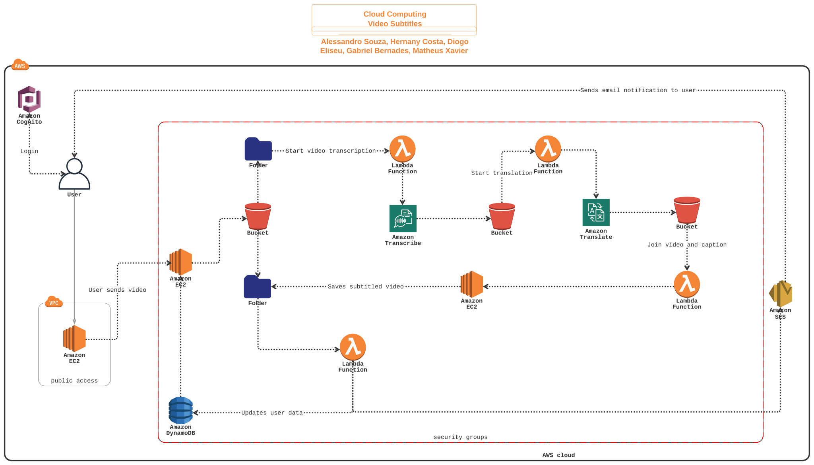

# Global Subtitles (Shark Subtitles)

An automatic video subtitling platform that leverages AWS cloud services to transcribe, translate, and overlay captions on videos.

## Project Overview

- **Automatic Transcription**: Uses Amazon Transcribe to convert speech to text.
- **Multi-language Translation**: Uses Amazon Translate to translate subtitles.
- **Dynamic Captioning**: A custom Caption API overlays subtitles onto the original video.
- **Serverless Architecture**: Powered by AWS Lambda for seamless integration between S3, Transcribe, and Translate.

## Documentation

Detailed instructions for setting up and using the project are available in the [docs](docs) folder:

1. [Network Security](docs/01_network_security.md)
2. [S3 Buckets](docs/02_buckets.md)
3. [Caption API](docs/03_caption_api.md)
4. [DynamoDB Setup](docs/04_dynamo.md)
5. [AWS Lambda Functions](docs/05_lambda_functions.md)
6. [User Interface](docs/06_interface.md)
7. [Amazon Cognito](docs/07_cognito.md)

